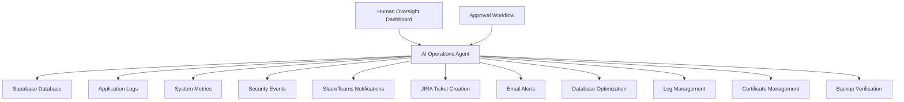

# AI Operations Agent - Feasibility Assessment
## Automated System Management and Monitoring

### Executive Summary
This document assesses the feasibility and requirements for implementing an AI-powered operations agent to automate system management, security monitoring, and operational tasks for the Secure Gate Access Kenya system.

## Current Operational Challenges

### 1. Manual Tasks for Small Teams
- **Database Maintenance**: Index optimization, query performance tuning
- **Security Monitoring**: Log analysis, anomaly detection, incident response
- **Compliance Tracking**: Data retention enforcement, audit trail generation
- **System Health**: Performance monitoring, capacity planning
- **User Support**: Common troubleshooting, access request processing

### 2. Alert Fatigue and Response Time
- Multiple monitoring tools generating noise
- 24/7 monitoring requirements vs. limited staff
- Context switching between different operational tasks
- Delayed response to critical security events

### 3. Compliance and Audit Requirements
- Continuous DPA compliance monitoring
- Automated evidence collection for audits
- Regular security assessments and reporting
- Data retention and cleanup automation

## AI Operations Agent Architecture

### 1. Core Components

#### Monitoring and Data Collection Agent
```python
class MonitoringAgent:
    def __init__(self):
        self.metrics_collectors = [
            DatabaseMetricsCollector(),
            ApplicationPerformanceCollector(), 
            SecurityEventCollector(),
            ComplianceMetricsCollector()
        ]
    
    async def collect_system_state(self):
        """Collect comprehensive system metrics"""
        return {
            'database': await self.collect_db_metrics(),
            'application': await self.collect_app_metrics(),
            'security': await self.collect_security_events(),
            'compliance': await self.assess_compliance_status()
        }
    
    async def analyze_anomalies(self, metrics):
        """Use ML models to detect unusual patterns"""
        anomalies = await self.anomaly_detector.analyze(metrics)
        return self.prioritize_alerts(anomalies)
```

#### Decision-Making Engine
```python
class OperationsDecisionEngine:
    def __init__(self):
        self.knowledge_base = OperationalKnowledgeBase()
        self.ml_models = {
            'anomaly_detection': AnomalyDetectionModel(),
            'capacity_planning': CapacityPlanningModel(),
            'security_classification': SecurityEventClassifier()
        }
    
    async def make_operational_decision(self, context):
        """Make automated operational decisions"""
        recommendations = []
        
        if context['type'] == 'security_incident':
            severity = await self.classify_security_severity(context)
            if severity >= 8:
                recommendations.append(self.escalate_to_human(context))
            else:
                recommendations.append(self.auto_remediate(context))
                
        elif context['type'] == 'performance_degradation':
            root_cause = await self.diagnose_performance_issue(context)
            recommendations.append(self.optimize_performance(root_cause))
            
        return recommendations
```

#### Action Execution Framework
```python
class AutomatedActionExecutor:
    def __init__(self):
        self.approved_actions = {
            'database_optimization': self.optimize_database_indices,
            'log_rotation': self.rotate_and_archive_logs,
            'certificate_renewal': self.renew_ssl_certificates,
            'backup_verification': self.verify_backup_integrity,
            'user_provisioning': self.provision_user_access
        }
    
    async def execute_safe_action(self, action_type, parameters):
        """Execute pre-approved automated actions"""
        if action_type not in self.approved_actions:
            return await self.request_human_approval(action_type, parameters)
            
        return await self.approved_actions[action_type](parameters)
```

### 2. AI Model Requirements

#### Anomaly Detection Model
```python
# Training data requirements
training_data = {
    'normal_patterns': [
        'api_response_times_95th_percentile < 200ms',
        'database_connections < 80% capacity',
        'failed_login_attempts < 5 per hour per IP',
        'memory_usage < 85% sustained'
    ],
    'anomaly_patterns': [
        'sudden_spike_in_failed_authentications',
        'unusual_data_access_patterns',
        'memory_leak_indicators',
        'ddos_attack_signatures'
    ]
}

class AnomalyDetectionModel:
    def __init__(self):
        self.model = IsolationForest(contamination=0.1)
        self.feature_extractors = [
            TimeSeriesFeatureExtractor(),
            SequentialPatternExtractor(),
            StatisticalFeatureExtractor()
        ]
    
    async def detect_anomalies(self, metrics_stream):
        features = self.extract_features(metrics_stream)
        anomaly_scores = self.model.decision_function(features)
        return self.interpret_anomaly_scores(anomaly_scores)
```

#### Predictive Maintenance Model
```python
class PredictiveMaintenanceModel:
    """Predict when system components need maintenance"""
    
    def __init__(self):
        self.models = {
            'disk_failure_prediction': XGBoostClassifier(),
            'database_performance_degradation': LSTMRegressor(),
            'ssl_certificate_expiry': TimeBasedPredictor()
        }
    
    async def predict_maintenance_needs(self, system_metrics):
        predictions = {}
        
        # Predict disk failures based on SMART data
        disk_health = await self.analyze_disk_health(system_metrics['storage'])
        predictions['disk_replacement'] = self.models['disk_failure_prediction'].predict(disk_health)
        
        # Predict database performance issues
        db_trends = await self.analyze_db_trends(system_metrics['database'])
        predictions['db_optimization'] = self.models['database_performance_degradation'].predict(db_trends)
        
        return predictions
```

### 3. Integration Architecture

#### System Integration Points


#### API Integration Layer
```typescript
// Integration with existing system
class SecureGateAIIntegration {
  constructor(private supabase: SupabaseClient) {}
  
  async getSystemHealth(): Promise<SystemHealthMetrics> {
    const [dbMetrics, appMetrics, securityEvents] = await Promise.all([
      this.getDatabaseMetrics(),
      this.getApplicationMetrics(), 
      this.getSecurityEvents()
    ]);
    
    return {
      database: dbMetrics,
      application: appMetrics,
      security: securityEvents,
      timestamp: new Date().toISOString()
    };
  }
  
  async executeAutomatedAction(action: AutomatedAction): Promise<ActionResult> {
    // Log all automated actions for audit trail
    await this.supabase.from('ai_operations_log').insert({
      action_type: action.type,
      parameters: action.parameters,
      executed_at: new Date().toISOString(),
      ai_confidence: action.confidence_score
    });
    
    return await this.actionExecutor.execute(action);
  }
}
```

## Implementation Phases

### Phase 1: Monitoring and Alerting (Months 1-2)
**Scope**: Basic monitoring agent with intelligent alerting

**Deliverables**:
- Metrics collection system
- Basic anomaly detection 
- Intelligent alert filtering
- Slack/email integration

**Estimated Effort**: 40-60 hours
**Technology Stack**: Python, Prometheus, Grafana, scikit-learn

**Code Example**:
```python
# Basic implementation
from datetime import datetime, timedelta
import asyncio
from sklearn.ensemble import IsolationForest

class BasicMonitoringAgent:
    def __init__(self):
        self.metrics_history = []
        self.anomaly_detector = IsolationForest(contamination=0.1)
        self.alert_thresholds = {
            'cpu_usage': 80,
            'memory_usage': 85,
            'failed_logins_per_hour': 10,
            'api_response_time_95th': 500
        }
    
    async def monitor_and_alert(self):
        while True:
            current_metrics = await self.collect_current_metrics()
            
            # Check threshold-based alerts
            alerts = self.check_thresholds(current_metrics)
            
            # Check ML-based anomaly detection
            if len(self.metrics_history) > 100:  # Need historical data
                anomalies = self.detect_anomalies([current_metrics])
                alerts.extend(anomalies)
            
            if alerts:
                await self.send_intelligent_alerts(alerts)
                
            self.metrics_history.append(current_metrics)
            await asyncio.sleep(60)  # Check every minute
```

### Phase 2: Predictive Analytics (Months 3-4)
**Scope**: Predictive models for capacity planning and maintenance

**Deliverables**:
- Capacity planning predictions
- Maintenance scheduling automation
- Performance optimization recommendations
- Trend analysis dashboards

**Estimated Effort**: 60-80 hours
**Technology Stack**: TensorFlow/PyTorch, Time Series Analysis

### Phase 3: Automated Remediation (Months 5-6)
**Scope**: Safe automated actions with human oversight

**Deliverables**:
- Pre-approved action execution
- Human approval workflow
- Rollback mechanisms
- Comprehensive audit logging

**Estimated Effort**: 80-100 hours
**Technology Stack**: Workflow engines, Infrastructure as Code

### Phase 4: Advanced AI Features (Months 7-8)
**Scope**: Natural language interaction and advanced decision-making

**Deliverables**:
- Chat-based operations interface
- Advanced incident response
- Compliance automation
- Self-healing system capabilities

**Estimated Effort**: 100-120 hours
**Technology Stack**: LLM integration, Advanced ML models

## Cost-Benefit Analysis

### Implementation Costs
- **Development**: $15,000-25,000 (160-280 hours at $75-100/hour)
- **Infrastructure**: $200-400/month (ML compute, storage)
- **Maintenance**: $2,000-3,000/year (ongoing updates, model retraining)
- **Total Year 1**: $20,000-30,000

### Expected Benefits
- **Labor Savings**: 10-15 hours/week operational tasks = $15,000-25,000/year
- **Downtime Prevention**: 99.9% uptime vs 99.5% = $5,000-10,000 saved/year
- **Security Incident Response**: Faster response = $10,000-20,000 risk reduction/year
- **Compliance Automation**: Audit preparation efficiency = $3,000-5,000/year

**ROI**: 65-100% in Year 1, 200%+ in subsequent years

## Risk Assessment and Mitigation

### 1. AI Decision-Making Risks
**Risk**: Incorrect automated actions causing system damage
**Mitigation**: 
- Gradual capability rollout with human oversight
- Comprehensive testing in staging environments
- Rollback mechanisms for all automated actions
- "Dry run" mode for new capabilities

### 2. Data Privacy and Security
**Risk**: AI agent accessing sensitive data inappropriately
**Mitigation**:
- Role-based access controls for AI agent
- Data anonymization for ML training
- Regular security audits of AI components
- Compliance with DPA requirements for automated processing

### 3. Over-Dependence on Automation
**Risk**: Team losing operational knowledge and skills
**Mitigation**:
- Maintain human expertise in critical areas
- Regular manual operation exercises
- Comprehensive documentation of all automated processes
- Gradual automation rollout with knowledge transfer

## Recommendation

### For Small Teams (2-5 people)
**Recommended Approach**: Phased implementation starting with Phase 1

**Benefits**:
- Immediate value from intelligent alerting
- Reduced operational burden
- Improved system reliability
- Cost-effective for small teams

**Implementation Strategy**:
1. Start with basic monitoring and alerting (Month 1-2)
2. Evaluate impact and team adoption
3. Proceed to predictive analytics if Phase 1 successful
4. Consider advanced features only after proven ROI

### Success Criteria
- **Operational Efficiency**: 50% reduction in manual monitoring tasks
- **Incident Response**: 75% faster mean time to detection
- **System Reliability**: 99.9% uptime achievement
- **Team Satisfaction**: Positive feedback on reduced operational stress

### Next Steps
1. **Proof of Concept** (2 weeks): Build basic monitoring agent
2. **Team Evaluation** (1 week): Assess team readiness and interest
3. **Implementation Planning** (1 week): Detailed project plan and timeline
4. **Development Sprint 1** (4 weeks): Core monitoring and alerting features

The AI Operations Agent represents a significant opportunity to improve system reliability and reduce operational burden for the Secure Gate Access Kenya system. The phased approach allows for validation of benefits while managing implementation risks effectively.
